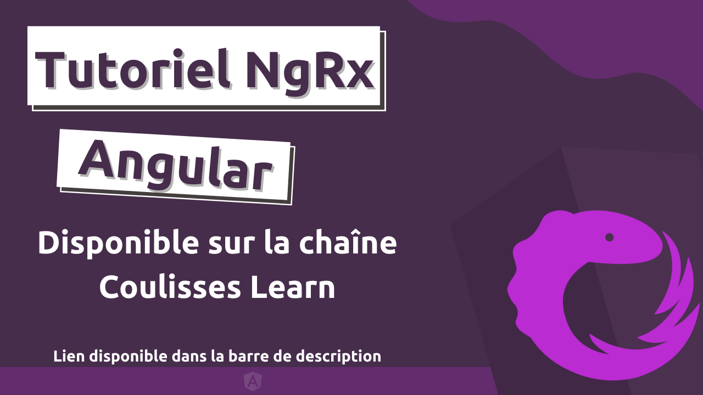

# Tutoriel NgRx

- Code source et materiel de la serie de tutoriels [Apprendre NgRx](https://youtube.com/playlist?list=PLckzBDi8b8tlYlsjJAb2yoMcmCCvWIGNd) sur Youtube.

## Usage 

- Sélectioner et Télécharger le contenu de la branche correspondante à la vidéo. 
(ex. partie-1 pour la vidéo 1 de la serie )

- Si une application s'y strouve, installer les dépendences Javascript avec `npm install`

